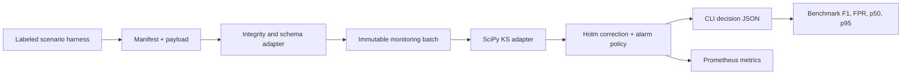

# #22 model-drift-detector

**Benchmark:** `drift_alarm_f1 = 1.00` (median of 3 source-locked Docker runs; image `sha256:fe60560a0d32b9cb6319cc7de7783b13c0caa93f24b33b95fdd143a8593251ac`).

**Proves:** an auditable post-deployment monitor can reject tampered batches, distinguish data and prediction drift from model-performance claims, control multiple tests, and score its alarm policy against deterministic scenario truth.

## Run

```bash
docker build -t model-drift-detector .
docker run --rm model-drift-detector
```

The default command needs no network, secret, paid API, database, broker, or cloud account at runtime. It writes and prints a portfolio benchmark result.

## Benchmark

| Metric | Value | Unit | Meaning |
|---|---:|---|---|
| Alarm F1 | 1.00 | ratio | median across 3 pinned-image runs |
| False-positive rate | 0.00 | ratio | stable scenarios incorrectly alarmed |
| Detection p95 | 35.48 | ms | median comparison and policy tail |
| Blind-spot detection | 0.00 | ratio | documented univariate correlation-only blind spot |

Publication evidence is complete: three independent 2,000-row runs share source commit `12534946`, one immutable image, one fixture digest, and zero failures. Raw runs are `benchmarks/results/run-{1,2,3}.json`; the source-locked result is `benchmarks/publication/model-drift-v2.json`.

## What It Monitors

- **Data drift:** a feature distribution changed.
- **Prediction drift:** the model output distribution changed.
- **Not claimed without labels:** concept drift, accuracy decay, or model-performance drift.

An alarm is an investigation signal. It is not proof that model quality degraded.

## Decision Rule

Each numeric feature and prediction column receives a two-sided Kolmogorov-Smirnov p-value and KS effect size. Holm correction controls family-wise error across columns. A column drifts only when adjusted significance and `KS >= 0.10` both hold. The batch alarms when at least one of eight features drifts or prediction drift is present.

The fixed benchmark contains eight stable scenarios, four mean shifts, four scale shifts, four prediction shifts, and two unscored correlation-only scenarios that document the univariate detector's blind spot.

## Artifact Contract

`monitoring-batch.manifest.json` records producer, model artifact identity, capture time, column roles, payload format, rows, bytes, and SHA-256. It also locks a successful upstream `validated-batch-manifest-v1`. The consumer:

1. resolves the payload inside the manifest directory;
2. rejects path escape, oversized files, unknown fields, duplicate columns, nulls, and non-finite values;
3. reconciles source, accepted, quarantine, and quality rows;
4. verifies every digest before parsing;
5. rejects incompatible producer, contract, model, time order, or feature schema;
6. requires exact CSV column order and row count.

The shared schema lives at [`monitoring-batch.schema.json`](.portfolio/contracts/monitoring-batch.schema.json).

## Detect Two Batches

```bash
model-drift-detector validate path/to/monitoring-batch.manifest.json
model-drift-detector detect reference/monitoring-batch.manifest.json current/monitoring-batch.manifest.json
```

## Architecture



The architecture is a pipeline because ordered evidence transformations dominate the problem. Narrow detector and telemetry ports preserve DIP and LSP without pretending the project needs a distributed clean-architecture framework.

## Portfolio System

| Repository | Responsibility | Shared boundary |
|---|---|---|
| #21 `mlops-end2end` | validate, train, register, promote, and serve | model identity and inference lifecycle |
| #22 `model-drift-detector` | inspect deployed feature and prediction batches | monitoring-batch manifest |
| #23 `feature-store-lite` | serve governed features | feature names, types, and freshness |
| #26 `data-quality-checks` | reject invalid source rows | data-contract failures before monitoring |

#22 does not import #21 code. Any producer can satisfy the versioned artifact contract.

## Engineering Proof

- Domain and application modules import no SciPy, Pydantic, Prometheus, Airflow, MLflow, Evidently, FastAPI, or cloud SDK.
- Statistical, artifact, policy, telemetry, fixture, and CLI behavior have focused tests.
- Docker uses a non-root user and a Python base pinned by tag and OCI digest.
- OpenSpec records intent, architecture self-challenge, reuse delta, benchmark questions, and release verification.
- Benchmark evidence is `current`: V2 provenance locks source, workload, dependency, image, and application-wheel digests while retaining all three metric samples.

## Local Development

```bash
python -m pip install -c constraints.lock -e ".[dev]"
pytest
ruff check src tests
```

The supported publication path is Docker. Host Python runs are development feedback only.

## References

See [REFERENCES.md](REFERENCES.md) for primary statistical, runtime, telemetry, and organization sources.
