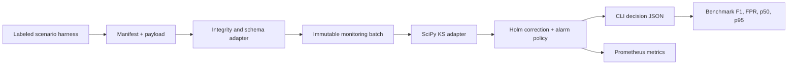

# Model Drift Detector: Auditable Post-Deployment Monitoring

**`drift_alarm_f1 = 1.00`** (median of 3 source-locked Docker runs) on labeled drift scenarios, with `0.00` false-positive rate and p95 detection of `35.48 ms`. The monitor rejects tampered batches before any statistics run, and it is explicit about what it cannot see.

[](https://github.com/Brilhante29/model-drift-detector/actions/workflows/validate.yml)
[](LICENSE)


## Why this exists

Drift dashboards fail in two opposite ways. They alarm on every batch because twenty columns are tested at once with no correction, or they report "model degraded" when all they measured was a shifted input distribution. Both erode trust. This detector is built to be believed:

- every batch arrives with a manifest; digests, schema, row counts, and lineage are verified before parsing;
- each feature and the prediction column get a two-sided Kolmogorov-Smirnov test plus an effect-size floor (`KS >= 0.10`), with Holm correction across columns;
- data drift and prediction drift are reported separately, and concept drift or accuracy decay are never claimed without labels;
- the alarm policy is scored against scenarios with known ground truth, including one it is known to miss.

An alarm is an investigation signal, not proof that model quality degraded.

## Results

| Metric | Value | Unit | Meaning |
|---|---:|---|---|
| Alarm F1 | 1.00 | ratio | Median across 3 pinned-image runs |
| False-positive rate | 0.00 | ratio | Stable scenarios incorrectly alarmed |
| Detection p95 | 35.48 | ms | Median comparison and policy tail |
| Blind-spot detection | 0.00 | ratio | Documented correlation-only blind spot |

The fixed benchmark has eight stable scenarios, four mean shifts, four scale shifts, four prediction shifts, and two unscored correlation-only scenarios. A perfect F1 is expected for shifts of the designed size; the blind-spot row is the honest part: a univariate test cannot see a change in correlation when every marginal distribution is unchanged.

Three independent 2,000-row runs share source commit `12534946`, one immutable image, one fixture digest, and zero failures.

## Quickstart

```bash
docker build -t model-drift-detector .
docker run --rm model-drift-detector
```

The default command needs no network, secret, paid API, database, broker, or cloud account.

Compare two real batches:

```bash
model-drift-detector validate path/to/monitoring-batch.manifest.json
model-drift-detector detect reference/monitoring-batch.manifest.json current/monitoring-batch.manifest.json
```

Local development:

```bash
python -m pip install -c constraints.lock -e ".[dev]"
pytest
ruff check src tests
```

## How it works


```mermaid
flowchart LR
    A[Manifest + payload] --> B[Integrity and schema adapter]
    B --> C[Immutable monitoring batch]
    C --> D[SciPy KS adapter]
    D --> E[Holm correction + alarm policy]
    E --> F[CLI decision JSON]
    E --> G[Prometheus metrics]
    H[Labeled scenario harness] --> A
    F --> I[Benchmark F1, FPR, p50, p95]
```

### Artifact contract

`monitoring-batch.manifest.json` records the producer, model artifact identity, capture time, column roles, payload format, rows, bytes, and SHA-256, and locks a successful upstream `validated-batch-manifest-v1`. Before any statistic is computed, the consumer:

1. resolves the payload inside the manifest directory;
2. rejects path escape, oversized files, unknown fields, duplicate columns, nulls, and non-finite values;
3. reconciles source, accepted, quarantine, and quality rows;
4. verifies every digest;
5. rejects incompatible producer, contract, model, time order, or feature schema;
6. requires exact CSV column order and row count.

The shared schema lives at [`monitoring-batch.schema.json`](.portfolio/contracts/monitoring-batch.schema.json).

## Design decisions

| Decision | Why | Rejected |
|---|---|---|
| KS test plus effect-size floor | Large batches make tiny, irrelevant shifts significant | p-value-only alarms |
| Holm correction | Controls family-wise error across many columns | Uncorrected per-column tests |
| Integrity before statistics | Statistics on a tampered or truncated batch are meaningless | Parsing whatever file arrives |
| Pipeline with narrow detector and telemetry ports | Ordered evidence transformations dominate the problem | A distributed clean-architecture framework |
| Domain free of SciPy, Pydantic, Prometheus, Evidently | Policy stays testable and portable | Framework-bound monitoring logic |

## Limitations

- Univariate tests: correlation-only drift is invisible by construction (documented as a scored blind spot).
- No labels, so no claims about accuracy, concept drift, or model-performance drift.
- Synthetic scenarios with designed shift sizes; real-world thresholds need calibration on production history.

## Reproducibility

- Raw runs: `benchmarks/results/run-{1,2,3}.json`.
- Source-locked result: [`benchmarks/publication/model-drift-v2.json`](benchmarks/publication/model-drift-v2.json), locking source, workload, dependencies, image `sha256:fe60560a0d32b9cb6319cc7de7783b13c0caa93f24b33b95fdd143a8593251ac`, and application-wheel digests.
- Non-root Docker image with a Python base pinned by tag and OCI digest.

## Project structure

```text
src/model_drift/     domain, application, artifact integrity, statistics, telemetry, CLI
tests/               statistical, artifact, policy, telemetry, fixture, and CLI tests
contracts/           monitoring observation batch contract
benchmarks/          raw runs and V2 publication evidence
sdd/  openspec/      specification, architecture self-challenge, release verification
```

## How this repository is built

The project follows the spec-driven workflow of [portfolio-reuse-kit](https://github.com/Brilhante29/portfolio-reuse-kit). Requirements and decisions live in [`sdd/`](sdd) and [`openspec/`](openspec), and [`project.yaml`](project.yaml) records the architecture, stack, and rejected alternatives. Development is AI-assisted and human-governed: [`AGENTS.md`](AGENTS.md) and [`CLAUDE.md`](CLAUDE.md) hold the coding-agent instructions, while tests, validators, and CI decide what gets published.

## Related work

| Repository | Responsibility | Shared boundary |
|---|---|---|
| [mlops-end2end](https://github.com/Brilhante29/mlops-end2end) | Validate, train, register, promote, serve | Model identity and inference lifecycle |
| model-drift-detector | Inspect deployed feature and prediction batches | Monitoring-batch manifest |
| [feature-store-lite](https://github.com/Brilhante29/feature-store-lite) | Serve governed features | Feature names, types, freshness |
| [data-quality-checks](https://github.com/Brilhante29/data-quality-checks) | Reject invalid source rows | Data-contract failures before monitoring |

No repository imports another's code; any producer can satisfy the versioned artifact contract. See [`REFERENCES.md`](REFERENCES.md) for statistical, runtime, and telemetry sources.

## Author

**Guilherme Brilhante**, software engineer working on scalable backends and production AI.
[LinkedIn](https://www.linkedin.com/in/guilhermefreirebrilhanteseveriano/) · [GitHub](https://github.com/Brilhante29) · [Publications](https://dblp.org/pid/353/6812.html)

## License

[MIT](LICENSE).
